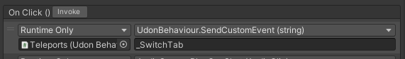

Tabs are the containers of the modules, you can access them from the "Selector" buttons (lower part of the tablet). Inactive tabs are stored in the "Misc" gameobject.

## Accesing tabs
You can use the **Tabs Managment** section of the tablet to activate different tabs and see them. Keep in mind that the tab that remains active when uploading the world will be the default tab displayed to the users.

## Adding new tabs
You can use the editor script to create a new empty tab. After you do so you will need to create a new selector button. Easiest way is to duplicate one of the existing ones, then change the target of the OnClick() unity event to the newly created tab.

