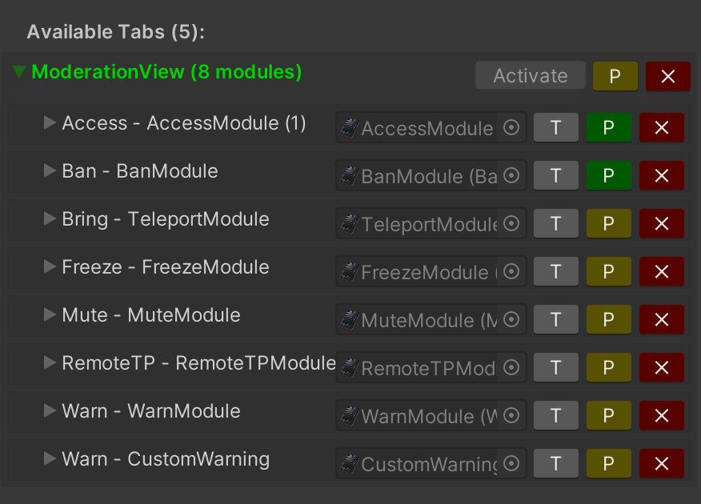
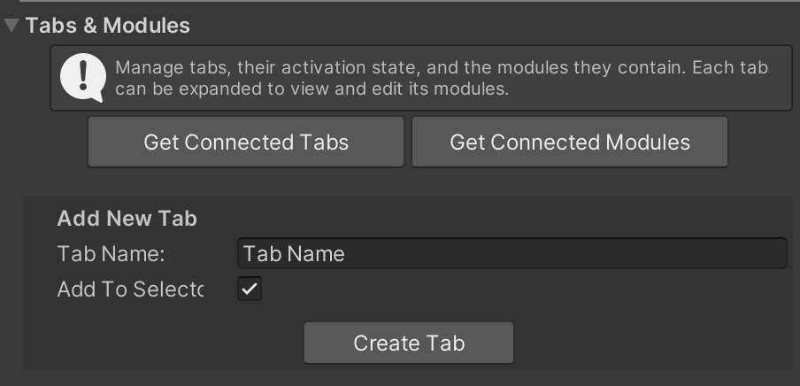

Tabs are the containers of the modules, you can access them from the "Selector" buttons (lower part of the tablet). Inactive tabs are stored in the **HiddenParent** (called "Misc") gameobject.

## Accessing tabs

You can see a list of tabs on the **Available Tabs** section of the main tablet script. The currently active tab (the one displayed on the tablet at that moment) will be highlighted in green.

From here you can access and edit the tabs modules. You can also change the tab permissions to prevent people from opening that tab. You can change the active tab by clicking the **Activate** button on the top right corner. This is useful when adding more modules to preview how the tab will look. Keep in mind that the tab that remains active when uploading the world will be the default tab displayed to the users.

## Adding new tabs

Simply input the name and hit the button, you can optionally mark the **AddToSelector** checkbox to automatically add a button for the new tab on the selector.

You can also create tabs manually by instantiating the **EmptyTabPrefab**, it is recommended to do so inside **HiddenParent** by default.

:::warning
When manually adding tabs or using other method make sure to pay attention to the default tabs scale and rotation, using incorrect values will make the tab look weird and may cause problems with the modules.
:::
