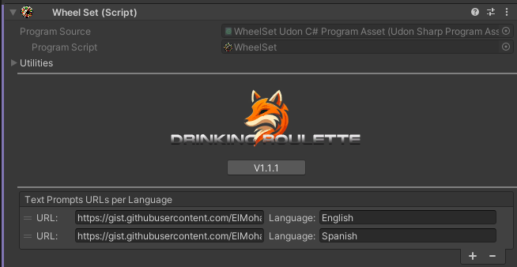

Prompt packs are packs of questions/dares/prompts that are used by the roullete and can be selected by users. Prompts are loaded using **External Urls** and support a different url per language.

:::warning
The prompts amount and order needs to be the same in all languages for proper syncronization.
:::

:::info
The first language on the list will be used if the local users language is not found in the prompt!
:::

## Variables

You can use variables at any point in a string and they will be replaced.

- `{player}` - local player name.
- `{RP}` - random player playing the game.
- `{R-X-Y}` - random number between X and Y.

:::tip
You can also use [RichText Tags](https://docs.unity3d.com/Packages/com.unity.textmeshpro@3.2/manual/RichText.html) in your strings!
:::
