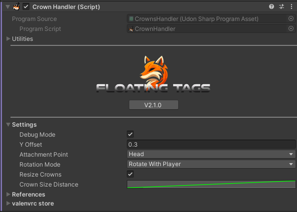

* Import ValenCommons from my [public VCC listing](https://valenvrc.com/)⚠️
* Import FloatingTags.unitypackage
* Locate the **Crowns** prefab inside `Packages/Valenvrc - FloatingTags/Runtime/` and drag it to your scene.

## Crown Handlers

CrownHandlers are in charge of storing which Crown a player has and moving them ontop of their head. If you want more than 1 crown per player you will need to duplicate the handler.

### Settings

* DebugMode : bool - Prints extra debug messages on console.
* Y Offset : float - Distance on Y axis from the attachment point.
* AttachmentPoint : VRCPlayerApi.TrackingDataType - Target place to put the crown on.
* RotationMode
  * None - Crown will not rotate.
  * With Player - Will rotate to match the rotation of the player that has the crown.
  * To LocalPlayer - Will rotate to always face the local player.
* ResizeCrowns : bool - Enables distance-based crown resize.
  * CrownSizeDistance : Curve - Controls the distance resize using a curve.

### References

ActiveCrowns : GameObject - GameObject that stores the each players crown.

:::tip
If you want to create a crowns toggle, dont disable the system itself, instead disable the **ActiveCrowns** gameobject!
:::

## Creating Crowns

Crowns are the different designs that will be put on players. They need to be placed as child of a CrownHandler. All crowns have a **Template** (called dummy by default), you can put **anything** inside it and it to be displayed on your players, by default its just text but you can add sprites, particles, gameobjects or a combination of everything!

### Player List

Each crown comes with a player list, here you can add names of players that will be granted this crown on join.

:::warning
Do not put a username on more than 1 crown player list of the same crownhandler, it will lead to undefined behaviour!
:::
