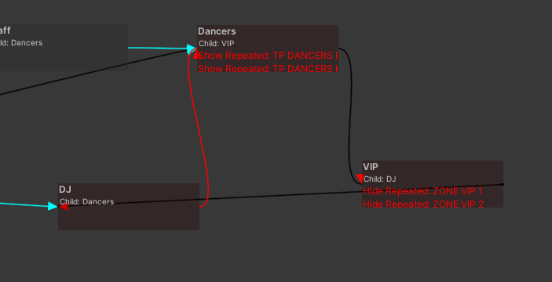

## Role Hierarchies

In 90% of cases your world/club/community has hierarchy of roles, for example:
`Admin -> Staff -> DJ -> VIP -> Normal User`

:::note
You dont need to have a role for "Normal User" this is a user with no role.
:::

In these cases, higher roles usually have all permissions of lower roles, thats when the **Child Role** feature kicks in, its an easy way to provide a role with all the permissions of another one without having to manually change them on each role, that way your role configuration its clean and easy to maintain.

:::tip
You can use the **Keypad Checker Tool** (on the topbar: valenvrc > keypad > checker tool) to look for duplicated entries and loops and have a clear view of your hierarchy.
:::

