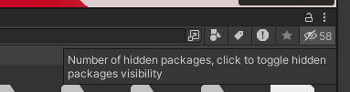

This page contain the documentation for my assets and systems. This is a community maintained project.

## Common Steps

To start with, here are some common steps and requirements of all my assets.

### Knowledge Requirements

Please note that the assets require a minimum understanding of Unity's editor and UI for installation and modification.

My assets are distributed as **Packages** therefore they are on the `"Packages/"` folder and not on the `"Assets/"` folder.

You should see them there by default, but in case you dont, make sure you have "Show Hidden Packages" enabled. You can turn it on using the eye button on the top right corner of the project tab.

Your prefabs are usually on the `"Runtime/"` folder.

### Requirements For Installation

- All my assets are tested using latest unity and sdk versions supported by VRChat
  - Right now those versions are 2022.3.22f1 and 3.9.0
- Most of my assets also require the latest version of my public libraries [ValenCommons](./category/valencommons/)

### Updating from an old version

:::danger
If you are upgrading from a *really old version*, double check if you have a folder called "ValeStuff" on the Assets folder. If you do, remove the "Public Scripts" and "[ASSET NAME]" folders from it.
:::

When updating from an old version it is advised to perform what I refer as a **Clean Install**:

- **Make a backup of your config!**
- Remove **the entire folder** of the package you are installing.
- Install the new version.
- Make sure to also perform a clean install of valencommons and any other dependencies.

This process *should* keep your config in most cases since it is stored on the hierarchy prefabs and not on the files. However some version may include breaking changes so you should always check the patch notes.

:::tip
My assets use [Semantic Versioning](https://semver.org/) so you can get a general idea of if a version contains breaking changes just by looking at its version number.
:::

### Licensing Activation

All my paid assets use a licensing system, when you get your asset from Jinxyy or Gumroad you get a **License Key** that you can use to activate the asset on Unity. To do so, go to:
`valenvrc/LicenseManager` on the topbar.

Once you open the License Manager you will be prompted to login into your VRChat Control Panel if you havent already, then you should see the Unity/VRChat account that you are using followed by the menu to activate your license. You will need to choose a **Store** and **Product**, then hit **Verify License**.

:::warning[]
Licenses get tied to the first VRChat account they are activated on. Licenses are not transferible.
:::

:::note[]
Jinxxy uses full license, not short one!
:::

***

## Contributing

This page is built with [Docusaurus](http://docusaurus.io/), if you want to contribute feel free to open a pull request at the [Github Repository](https://github.com/ElMoha943/valenvrc-docs), please follow the guidelines and test locally. We are actively searching for help localizing the docs to other languages!

## Support

If you need help please reach out at my **[Discord Server](https://discord.gg/MyVeCdx6QE)**. Do not DM me or send me friend requests on discord or other social media asking for support.

Support is not included. Any assistance provided is offered voluntarily, in good faith, and during free time. Any support given will be strictly about the asset itself and not unity, if you got unrelated errors that are preventing you from correctly using the assets I can't guarantee that I will be able to help.

Support is only given to verified customers that bought my assets, if you bought a prefab/world that utilizes my assets the creator you bought it from is the one in charge of assisting you.
