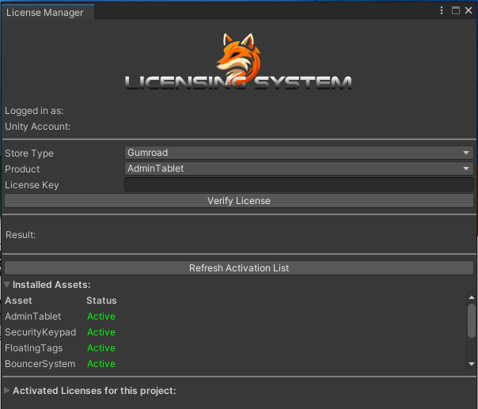

This page contain the documentation for my assets and systems. This is a community mantained project.

## Common Steps
To start with, here are some common steps and requirements of all my assets.

### Knowloadge Requirements
Please note that the assets require a minimum understanding of Unity's editor and UI for installation and modification.

### Requirements For Installation
- All my assets are tested using latest unity and sdk versions supported by VRChat
 - Right now those versions are 2022.3.22f1 and 3.9.0
- Most of my assets also require the latest version of my public libraries [ValenCommons](./category/valencommons/)

### Licensing Activation
All my paid assets use a licensing system, when you get your asset from Jinxyy or Gumroad you get a **License Key** that you can use to activate the asset on Unity. To do so, go to:
`valenvrc/LicenseManager` on the topbar.

Once you open the License Manager you will be prompted to login into your VRChat Control Panel if you havent already, then you should see the Unity/VRChat account that you are using followed by the menu to activate your license. You will need to choose a **Store** and **Product**, then hit **Verify License**.

:::warning[]
Licenses get tied to the first VRChat account they are activated on. Licenses are not transferible.
:::

:::note[]
Jinxxy uses full license, not short one!
:::

***

## Contributing
This page is built with [Docusaurus](http://docusaurus.io/), if you want to contribute feel free to open a pull request at the [Github Repository](https://github.com/ElMoha943/valenvrc-docs), please follow the guideliness and test locally. We are actively searching for help localizing the docs to other languages!

## Support
If you need help please reach out at my **[Discord Server](https://discord.gg/MyVeCdx6QE)**. Do not DM me or send me friend requests on discord or other social media asking for support.

Support is not included. Any assistance provided is offered voluntarily, in good faith, and during free time. Any support given will be strictly about the asset itself and not unity, if you got unrelated errors that are preventing you from correctly using the assets I can't guarantee that I will be able to help. 

Support is only given to verified customers that bought my assets, if you bought a prefab/world that utilizes my assets the creator you bought it from is the one in charge of assisting you.