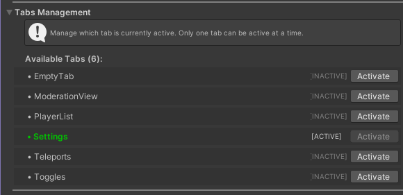
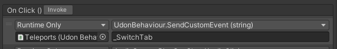

Las pestañas son los contenedores de los módulos, puedes acceder a ellas desde los botones "Selector" (parte inferior de la tableta). Las pestañas inactivas se almacenan en el gameobject "Misc".

## Acceder a las pestañas

Puedes usar la sección **Tabs Managment** de la tableta para activar diferentes pestañas y verlas. Ten en cuenta que la pestaña que permanezca activa al subir el mundo será la pestaña predeterminada mostrada a los usuarios.

## Agregar nuevas pestañas

:::info
Esta parte de la guía contiene contenido actualmente en Beta, puede diferir de la configuración actual.
:::

Puedes usar el script del editor para crear una nueva pestaña vacía. Después de hacerlo necesitarás crear un nuevo botón selector. La forma más fácil es duplicar uno de los existentes, luego cambiar el objetivo del evento unity OnClick() a la pestaña recién creada.

