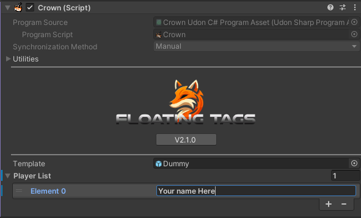

* Importa ValenCommons desde mi [listado público de VCC](https://valenvrc.com/)⚠️
* Importa FloatingTags.unitypackage
* Localiza el prefab **Crowns** dentro de `Packages/Valenvrc - FloatingTags/Runtime/` y arrástralo a tu escena.

## Crown Handlers

Los CrownHandlers son responsables de almacenar qué Corona tiene un jugador y moverlas encima de su cabeza. Si deseas más de 1 corona por jugador necesitarás duplicar el handler.

### Settings

* DebugMode : bool - Imprime mensajes de depuración adicionales en consola.
* Y Offset : float - Distancia en el eje Y desde el punto de unión.
* AttachmentPoint : VRCPlayerApi.TrackingDataType - Lugar objetivo para poner la corona.
* RotationMode
  * None - La corona no rotará.
  * With Player - Rotará para coincidir con la rotación del jugador que tiene la corona.
  * To LocalPlayer - Rotará para siempre mirar al jugador local.
* ResizeCrowns : bool - Habilita el redimensionamiento de corona basado en distancia.
  * CrownSizeDistance : Curve - Controla el redimensionamiento de distancia usando una curva.

### References

ActiveCrowns : GameObject - GameObject que almacena la corona de cada jugador.

:::tip
Si deseas crear un toggle de coronas, no deshabilites el sistema en sí, ¡deshabilita el gameobject **ActiveCrowns**!
:::

## Crear Coronas

Las coronas son los diferentes diseños que se pondrán en los jugadores. Necesitan ser colocadas como hijos de un CrownHandler. Todas las coronas tienen una **Template** (llamada dummy por defecto), puedes poner **cualquier cosa** dentro de ella para que se muestre en tus jugadores, por defecto es solo texto pero puedes agregar sprites, partículas, gameobjects o una combinación de todo!

### Player List

Cada corona viene con una lista de jugadores, aquí puedes agregar nombres de jugadores a quienes se les otorgará esta corona al unirse.

:::warning
No pongas un nombre de usuario en más de 1 lista de jugadores de corona del mismo crownhandler, ¡llevará a comportamiento indefinido!
:::
