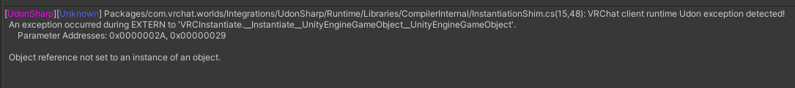
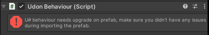
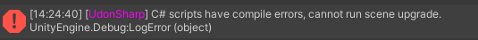

Aquí hay una lista de problemas comunes y cómo resolverlos.

## Referencias faltantes

Si ves algo como
`Object reference not set to an instance of an object`
Tienes un objeto vacío/faltante en alguna parte de la configuración. Busca cosas que digan **"None"** o **"Missing"** en tu inspector y llénalas.

## Cannot find definition for X are you missing a reference?

Esto es causado porque el script necesita una dependencia que te falta. Verifica dos veces que estés usando la última versión de todo (incluyendo vrchat sdk y la versión de unity soportada). Si tienes la dependencia instalada puede ser que no actualizaste correctamente tu asset, haz una instalación limpia tanto del asset como de sus dependencias.

## No puede Compilar/Actualizar

Este error significa que tus nuevos scripts no pueden cargarse debido a un error que puede no necesariamente ser de ese asset que estás importando, en este caso necesitas revisar tu consola para encontrar la causa exacta del error.

Solo nos importan los Errores (icono rojo) no las advertencias o mensajes, así que es mejor desactivar esos, presionar limpiar y tomar una captura de pantalla de los mensajes restantes. Siempre envía una captura de pantalla de tu consola completa, incluso si piensas que algo no es importante (spoiler: probablemente lo es).

## Asset no funciona o tiene problemas de desincronización en la Versión Quest

Después de verificar dos veces que el asset es compatible con quest y seguir cualquier paso extra requerido para ello, verifica dos veces que el [Network Id](https://creators.vrchat.com/worlds/udon/networking/network-id-utility/) del asset es el mismo en la versión pc y quest, usualmente es una buena práctica tener ambas versiones en el mismo proyecto y usar herramientas como [Easy Quest Switch](https://github.com/vrchat-community/EasyQuestSwitch).

:::tip
Personalmente recomiendo no usar la función multibuild del sdk y en su lugar construir cada versión manualmente ya que parece tener muchos bugs.
:::

## Depuración en el Juego

:::info
Vrchat anunció recientemente nuevas DebugUIs en las que se está trabajando, esta información puede estar desactualizada.
:::

En Steam, navega a VRChat y haz clic derecho -> Propiedades; ve a la pestaña "General" y bajo Opciones de lanzamiento, agrega lo siguiente en el campo de texto:

`--enable-udon-debug-logging` - Permite que los errores de consola se impriman en la consola de tu proyecto unity.

`--enable-debug-gui` - Habilita el menú de depuración de mundo en VRChat

Una vez que agregaste los parámetros abre vrchat en **modo escritorio** e ingresa la siguiente combinación de teclas:
`R Shift + ~ + 1 - 9`
-# usualmente nos interesa la Consola, que es el número 3.

:::note
Nota, esto no funciona con el teclado numérico, solo con los números del teclado. El menú de depuración solo funciona si eres el creador del mundo, o el mundo tiene la depuración habilitada en la configuración de subida.
:::

**Más información sobre vistas de depuración**: https://creators.vrchat.com/worlds/udon/world-debug-views/
