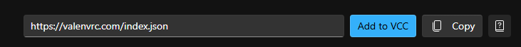
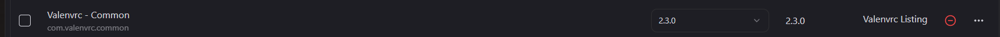

Puedes instalar valencommons desde mi [Listado VPM](https://valenvrc.com/), solo haz clic en el botón "Add To VCC" o copia manualmente el enlace y ponlo en tu Creator Companion o ALCOM.

Lo encontrarás en la carpeta **Packages** (no ASSETS). Encontrarás los scripts y prefabs en
`Packages/Valenvrc - Common/Runtime`.
