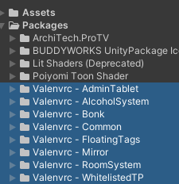
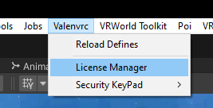

:::warning
El idioma principal de esta guía es el inglés, es posible que la versión en español contenga información incompleta o desactualizada. Ante la duda por favor consultar la guía original.
:::

Esta página contiene la documentación para mis assets y sistemas. Este es un proyecto mantenido por la comunidad.

## Pasos Comunes

Para empezar, aquí hay algunos pasos comunes y requisitos de todos mis assets.

### Requisitos de Conocimiento

Por favor ten en cuenta que los assets requieren un entendimiento mínimo del editor de Unity y su interfaz para la instalación y modificación.

Mis assets se distribuyen como **Packages** por lo tanto están en la carpeta `"Packages/"` y no en la carpeta `"Assets/"`.

Deberías verlos ahí por defecto, pero en caso de que no, asegúrate de tener "Show Hidden Packages" habilitado. Puedes activarlo usando el botón de ojo en la esquina superior derecha de la pestaña del proyecto.

Los prefabs usualmente están en la carpeta `"Runtime/"`.

### Requisitos Para la Instalación

- Todos mis assets son probados usando las últimas versiones de Unity y SDK soportadas por VRChat
  - Actualmente esas versiones son 2022.3.22f1 y 3.9.0
- La mayoría de mis assets también requieren la última versión de mis librerías gratuitas [ValenCommons](./category/valencommons/)

### Actualizar desde una versión antigua

:::danger
Si estás actualizando desde una *versión muy antigua*, verifica si tienes una carpeta llamada "ValeStuff" en la carpeta Assets. Si la tienes, elimina las carpetas "Public Scripts" y "[ASSET NAME]" de ella.
:::

Cuando actualices desde una versión antigua se aconseja realizar lo que llamo una **Instalación Limpia**:

- **¡Haz una copia de seguridad de tu configuración!**
- Elimina **la carpeta completa** del paquete que estás instalando.
- Instala la nueva versión.
- Asegúrate de también realizar una instalación limpia de valencommons y cualquier otra dependencia.

Este proceso *debería* mantener tu configuración en la mayoría de los casos ya que se almacena en los prefabs de la jerarquía y no en los archivos. Sin embargo, algunas versiones pueden incluir cambios importantes, por lo que siempre debes revisar las notas del parche.

:::tip
Mis assets usan [Semantic Versioning](https://semver.org/) así que puedes tener una idea general de si una versión contiene cambios importantes solo mirando su número de versión.
:::

### Activación de Licencia

Todos mis assets de pago usan un sistema de licencias, cuando obtienes tu asset de Jinxyy o Gumroad obtienes una **Clave de Licencia** que puedes usar para activar el asset en Unity. Para hacerlo, ve a:
`valenvrc/LicenseManager` en la barra superior.

Una vez que abras el Administrador de Licencias se te pedirá que inicies sesión en tu Panel de Control de VRChat si aún no lo has hecho, luego deberías ver la cuenta de Unity/VRChat que estás usando seguida del menú para activar tu licencia. Necesitarás elegir una **Tienda** y **Producto**, luego presiona **Verify License**.

:::warning[]
Las licencias se vinculan a la primera cuenta de VRChat en la que se activan. Las licencias no son transferibles.
:::

:::note[]
¡Jinxxy usa licencia completa, no la corta!
:::

***

## Contribuir

Esta página está construida con [Docusaurus](http://docusaurus.io/), si quieres contribuir siéntete libre de abrir un pull request en el [Repositorio de Github](https://github.com/ElMoha943/valenvrc-docs), por favor sigue las pautas y prueba localmente. ¡Estamos buscando activamente ayuda para localizar la documentación a otros idiomas!

## Soporte

Si necesitas ayuda por favor comunícate en mi **[Servidor de Discord](https://discord.gg/MyVeCdx6QE)**. No me envíes mensajes directos ni solicitudes de amistad en Discord u otras redes sociales pidiendo soporte.

El soporte no está incluido. Cualquier asistencia proporcionada se ofrece voluntariamente, de buena fe y durante el tiempo libre. Cualquier soporte dado será estrictamente sobre el asset en sí y no sobre Unity, si tienes errores no relacionados que te impiden usar correctamente los assets no puedo garantizar que podré ayudarte.

El soporte solo se brinda a clientes verificados que compraron mis assets, si compraste un prefab/mundo que utiliza mis assets el creador a quien se lo compraste es el encargado de asistirte.
